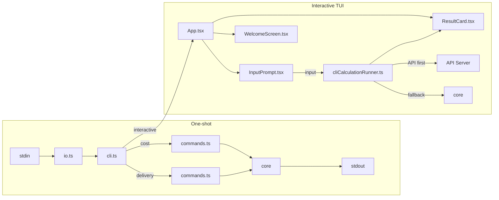

# @nurulizyansyaza/courier-service-cli

CLI application for the **Courier Service** App Calculator. Supports two modes:
- **One-shot** — pipe input from stdin for quick cost/time calculations
- **Interactive TUI** — full terminal UI with bordered panels, colored output, command history, API integration, and session persistence

## Setup

### Prerequisites
- **Node.js** ≥ 18 (required for native `fetch` and Ink TUI)
- **courier-service-core** must be built first (local dependency)

### Install & Build

```bash
# 1. Build the core library first (required dependency)
cd courier-service-core
npm install
npm run build

# 2. Build and install the CLI
cd ../courier-service-cli
npm install
npm run build        # or: npx tsc
```

### Run Interactive TUI

```bash
# Local-only mode (no API needed)
node bin/courier-service interactive --local

# With API (start API server first in another terminal)
node bin/courier-service interactive
```

### Run with API Server

```bash
# Terminal 1: Start the API server
cd courier-service-api
npm install
npm run build
npm start
# API runs on http://localhost:3000

# Terminal 2: Launch CLI (connects to API automatically)
cd courier-service-cli
node bin/courier-service interactive

# Or specify a custom API URL
node bin/courier-service interactive --api-url http://localhost:4000
```

### Run One-shot Mode (stdin)

```bash
# Cost calculation
printf '100 3\nPKG1 5 5 OFR001\nPKG2 15 5 OFR002\nPKG3 10 100 OFR003\n' | node bin/courier-service cost

# Delivery time calculation
printf '100 5\nPKG1 50 30 OFR001\nPKG2 75 125 OFR008\nPKG3 175 100 OFR003\nPKG4 110 60 OFR002\nPKG5 155 95 NA\n2 70 200\n' | node bin/courier-service delivery
```

### Verify Installation

```bash
node bin/courier-service --version
node bin/courier-service --help
```

## Usage

### Interactive TUI Mode (Recommended)

```bash
node bin/courier-service interactive
```

Launches a full terminal UI powered by [Ink](https://github.com/vadimdemedes/ink) (React for the terminal):

- Bordered panels with color-coded output matching the frontend theme
- ↑/↓ arrow keys to navigate command history
- API-first calculation with local fallback
- Transit package tracking across calculations
- Session persistence (mode, API URL, history saved to `~/.courier-cli-session.json`)

**Options:**
- `--api-url <url>` — API server URL (default: `http://localhost:3000`)
- `--local` — Skip API, calculate locally only

```bash
node bin/courier-service interactive --local
node bin/courier-service interactive --api-url http://localhost:4000
```

### Interactive Commands

| Command | Description |
|---------|-------------|
| `/change mode cost \| time` | Switch calculation mode |
| `clear` | Clear screen |
| `/restart` | Show welcome screen |
| `help` | Show available commands |
| `↑` / `↓` | Navigate command history |
| `Ctrl+C` | Cancel current input |

### Problem 1 — Delivery Cost Estimation (One-shot)

```bash
printf '100 3\nPKG1 5 5 OFR001\nPKG2 15 5 OFR002\nPKG3 10 100 OFR003\n' | node bin/courier-service cost
```

Output:
```
PKG1 0 175
PKG2 0 275
PKG3 35 665
```

### Problem 2 — Delivery Time Estimation (One-shot)

```bash
printf '100 5\nPKG1 50 30 OFR001\nPKG2 75 125 OFR008\nPKG3 175 100 OFR003\nPKG4 110 60 OFR002\nPKG5 155 95 NA\n2 70 200\n' | node bin/courier-service delivery
```

Output:
```
PKG1 0 750 4.00
PKG2 0 1475 1.78
PKG3 0 2350 1.42
PKG4 105 1395 0.85
PKG5 0 2125 4.21
```

### Detailed Delivery Output

Use `--detailed` to see vehicle assignments, delivery rounds, and return times:

```bash
printf '100 5\nPKG1 50 30 OFR001\nPKG2 75 125 OFR008\nPKG3 175 100 OFR003\nPKG4 110 60 OFR002\nPKG5 155 95 NA\n2 70 200\n' | node bin/courier-service delivery --detailed
```

Output:
```
PKG1 0 750 4.00
  └─ vehicle=1 round=4 return=4.43
PKG2 0 1475 1.78
  └─ vehicle=1 round=1 return=3.57
PKG3 0 2350 1.42
  └─ vehicle=2 round=2 return=2.86
PKG4 105 1395 0.85
  └─ vehicle=1 round=1 return=3.57
PKG5 0 2125 4.21
  └─ vehicle=2 round=3 return=5.57
```

### Input Format

**Cost Mode:**
```
baseCost packageCount
pkgId weight distance offerCode
...
```

**Time Mode (same as above + fleet line):**
```
baseCost packageCount
pkgId weight distance offerCode
...
vehicleCount maxSpeed maxWeight
```

## Feature Parity with React Frontend

The interactive TUI replicates the React frontend's full functionality in a terminal environment:

| Feature | Frontend (React) | CLI (Ink TUI) |
|---------|-----------------|---------------|
| **Cost calculation** | ✅ | ✅ Same core engine |
| **Time calculation** | ✅ | ✅ With vehicle assignments |
| **Offer discounts** | ✅ | ✅ OFR001/002/003 |
| **Transit tracking** | ✅ | ✅ Stateful across calculations |
| **Package renaming** | ✅ | ✅ Conflict detection |
| **API integration** | ✅ fetch → fallback | ✅ fetch → fallback |
| **Local-only mode** | ✅ Auto-fallback | ✅ `--local` flag |
| **Welcome screen** | ✅ ASCII art + offers | ✅ Matching ASCII art + offers |
| **Result cards** | ✅ Cost breakdown, formula | ✅ Full breakdown with formula |
| **Error display** | ✅ Red text | ✅ Red text (matching style) |
| **Undeliverable warnings** | ✅ Amber banner | ✅ Amber ⚠ indicator |
| **Vehicle/round info** | ✅ | ✅ |
| **Command routing** | ✅ 9 commands | ✅ 4 commands + shortcuts |
| **Command history** | ✅ ↑/↓ localStorage | ✅ ↑/↓ session file |
| **Session persistence** | ✅ localStorage | ✅ `~/.courier-cli-session.json` |
| **Color theme** | ✅ Tailwind pink/cyan | ✅ Chalk pink/cyan (matched) |
| **Mode switching** | ✅ `/change mode` | ✅ `/change mode` |
| **Ctrl+C** | ✅ Clear input | ✅ Cancel input |
| **Multi-tab** | ✅ | N/A (terminal instances) |
| **Framework switching** | ✅ React/Vue/Svelte | N/A (Ink only) |

### Shared Core Logic

Both the CLI and frontend use the same calculation engine from `@nurulizyansyaza/courier-service-core`:
- `parseInput()` — strict validation with multi-error collection
- `calculatePackageCost()` — cost with offer discounts
- `computeDeliveryResultsFromParsed()` — delivery time with vehicle scheduling
- `calculateDeliveryTimeWithTransit()` — transit-aware calculations

### Using with the API Server

For full API integration, start the API server first:

```bash
# Terminal 1: Start the API server
cd ../courier-service-api
npm install && npm run build && npm start

# Terminal 2: Launch CLI connected to API
cd ../courier-service-cli
node bin/courier-service interactive
# API defaults to http://localhost:3000
```

The CLI will try the API first for validation/rate-limiting benefits, then fall back to local core calculations if the API is unreachable.

## Testing

```bash
npm test
```

**31 tests** across 5 test suites:
- `commands.test.ts` — Cost/delivery one-shot calculation tests
- `io.test.ts` — stdin reader tests
- `cliCommands.test.ts` — Interactive command routing tests
- `cliCalculationRunner.test.ts` — API+fallback calculation tests
- `cliSession.test.ts` — Session persistence tests

## Dependencies

| Package | Purpose |
|---------|---------|
| `@nurulizyansyaza/courier-service-core` | Core calculation engine |
| `commander` | One-shot CLI argument parsing |
| `ink` | React-based terminal UI framework |
| `react` | Component model for Ink (v17) |
| `ink-text-input` | Text input component |
| `ink-spinner` | Loading spinner component |
| `chalk` | Terminal string styling |

## CLI Flow



## Project Structure

```
src/
  cli.ts                    # Commander.js entry point (cost, delivery, interactive)
  io.ts                     # stdin reader
  commands.ts               # runCost, runDelivery (one-shot mode)
  index.ts                  # Barrel exports
  cliCommands.ts            # Interactive command routing
  cliCalculationRunner.ts   # API-first + local fallback calculation
  cliSession.ts             # File-based session persistence
  ui/
    App.tsx                 # Root Ink component, state management
    WelcomeScreen.tsx       # ASCII art, offers table, input format
    InputPrompt.tsx         # Text input with mode indicator, history
    ResultCard.tsx          # Bordered result display per package
    ErrorDisplay.tsx        # Red bordered error panel
    StatusBar.tsx           # Mode / API / transit status
    HelpScreen.tsx          # Available commands box
    theme.ts                # Color constants matching frontend
bin/
  courier-service           # Executable entry point
__tests__/
  commands.test.ts          # One-shot calculation tests
  io.test.ts                # stdin reader tests
  cliCommands.test.ts       # Command routing tests
  cliCalculationRunner.test.ts  # Calculation runner tests
  cliSession.test.ts        # Session persistence tests
```

## CI/CD

GitHub Actions workflow (`.github/workflows/ci.yml`) runs on push/PR to `main`:

1. **Test** — checks out `courier-service-core`, builds it, then runs CLI tests on Node 18 + 20
2. **Trigger Staging Deploy** — on push to `main`, triggers a staging deploy on [`courier-service`](https://github.com/nurulizyansyaza/courier-service), which triggers the staging deployment pipeline

Requires a `DEPLOY_TRIGGER_TOKEN` secret (fine-grained PAT with Actions + Contents write access on the `courier-service` repo).

## Changelog

### v1.2.0 — UI Parity with Frontend

**UI Improvements (matching React frontend exactly):**
- **Welcome screen** — full-size motorcycle ASCII art + COURIER block letters with spacing between them
- **Result cards** — complete cost breakdown with formula (`baseCost + (weight × 10) + (distance × 5)`), discount percentage, offer code, base cost/weight/distance, vehicle round details, packages remaining, round trip times
- **Error display** — simplified to match frontend (plain red text, no bordered box)
- **Help screen** — matching command colors (emerald/amber/cyan) and layout
- **Input prompt** — custom raw input handler replacing `ink-text-input` for proper Ctrl+C and arrow key behavior; hint text shown below prompt
- **Custom input handling** — replaced `ink-text-input` with direct `useInput` for reliable Ctrl+C cancel, history navigation, and no conflicts with Ink's built-in key handling

**Commands Removed:**
- `/connect` and `/disconnect` — API URL is now set via CLI flags only (`--api-url`, `--local`)
- `exit` — removed to prevent accidental process termination; use terminal's native Ctrl+C (twice) to close
- "API: connected" status bar indicator removed

**Data Enhancements:**
- Unified `PackageResult` type with all detail fields (baseCost, weight, distance, offerCode, deliveryCost, deliveryRound, vehicleId, packagesRemaining, currentTime, vehicleReturnTime, roundTripTime)
- Result card shows delivery cost formula breakdown
- Discount shown with percentage of delivery cost
- Renamed package indicator (`was PKG1`)
- Undeliverable banner with amber ⚠ warning

### v1.1.0 — Interactive TUI Mode

**New Features:**
- **Interactive TUI** — full terminal UI powered by Ink (React for the terminal)
  - Bordered panels with pink/cyan/emerald color theme matching the frontend
  - Welcome screen with ASCII art, available offers table, input format guide
  - Per-package result cards with cost breakdown, discount, delivery time, vehicle info
  - Red bordered error panel showing all validation errors
  - Status bar showing mode, API connection, transit count
  - Help screen with all available commands
- **API integration** — API-first calculation with automatic local fallback
  - Connect/disconnect via `/connect [url]` and `/disconnect` commands
  - Configurable API URL via `--api-url` flag
  - `--local` flag for offline-only mode
- **Transit package tracking** — stateful across calculations with rename detection
- **Command history** — ↑/↓ arrow keys to navigate previous commands
- **Session persistence** — mode, API URL, history saved to `~/.courier-cli-session.json`
- **Multi-line input** — auto-detects expected line count from header, shows line numbers
- **9 interactive commands** — `/change mode`, `/connect`, `/disconnect`, `clear`, `/restart`, `help`, `exit`, `Ctrl+C`

**New Dependencies:**
- `ink@3` — React-based terminal UI framework
- `react@17` — Component model (v17 required by ink@3 peer deps)
- `ink-text-input@4` — Text input component
- `ink-spinner@4` — Loading spinner
- `chalk@4` — Terminal string styling

**New Files:**
- `src/ui/` — 7 Ink React components + theme
- `src/cliCalculationRunner.ts` — API + local fallback
- `src/cliCommands.ts` — Command routing
- `src/cliSession.ts` — File-based session persistence

**Tests:** 9 → 35 tests (26 new across 3 test suites)

### v1.0.0 — Initial Release

- One-shot `cost` and `delivery` commands via stdin
- `--detailed` flag for vehicle/round info
- 9 tests across 2 test suites
