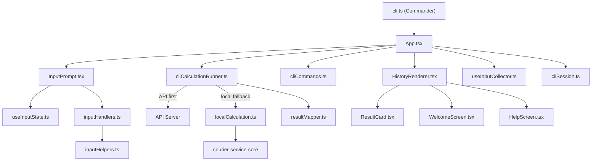

# @nurulizyansyaza/courier-service-cli

Interactive terminal UI for the **Courier Service** delivery cost and time calculator. Built with [Ink](https://github.com/vadimdemedes/ink) (React for the terminal).

## Setup

### Prerequisites
- **Node.js** ≥ 18
- **courier-service-core** must be built first (local dependency)

### Install & Build

```bash
# 1. Build the core library first
cd courier-service-core
npm install && npm run build

# 2. Build and install the CLI
cd ../courier-service-cli
npm install && npm run build
```

### Run

```bash
# Local-only mode (no API needed)
node bin/courier-service --local

# With API (start API server first in another terminal)
node bin/courier-service

# Custom API URL
node bin/courier-service --api-url http://localhost:4000
```

### Run with API Server

```bash
# Terminal 1: Start the API server
cd courier-service-api
npm install && npm run build && npm start

# Terminal 2: Launch CLI (connects to API automatically)
cd courier-service-cli
node bin/courier-service
```

## Usage

The CLI launches a full terminal UI:

- Color-coded output matching the frontend theme (pink/cyan/emerald)
- ↑/↓ arrow keys to navigate command history
- Multi-line paste support with preview and confirmation
- API-first calculation with local fallback
- Transit package tracking across calculations
- Session persistence (mode, API URL, history saved to `~/.courier-cli-session.json`)

### Commands

| Command | Description |
|---------|-------------|
| `/change mode cost \| time` | Switch calculation mode |
| `clear` | Clear screen and show welcome |
| `help` | Show available commands |
| `exit` / `quit` | Exit the application |
| `↑` / `↓` | Navigate command history |
| `←` / `→` | Move cursor within input |
| `Ctrl+C` | Cancel current input |

### Input Format

**Cost Mode:**
```
baseCost packageCount
pkgId weight distance offerCode
...
```

**Time Mode (cost mode + fleet line):**
```
baseCost packageCount
pkgId weight distance offerCode
...
vehicleCount maxSpeed maxWeight
```

### Example

```
100 3
pkg1 50 70 ofr001
pkg2 75 70 ofr003
pkg3 100 200 ofr002
2 70 200
```

## Testing

```bash
npm test
```

| Suite | Tests | Description |
|-------|-------|-------------|
| `cliCommands.test.ts` | 13 | Command routing — `/change mode`, `clear`, `help`, `exit` |
| `cliCalculationRunner.test.ts` | 7 | Calculation runner — API + local fallback behavior |
| `localCalculation.test.ts` | 11 | Local calculation — cost, time, transit modes |
| `cliSession.test.ts` | 5 | Session persistence — load, save, clear session |
| `cliSession.integration.test.ts` | 8 | Integration — session file read/write/clear |
| `resultMapper.test.ts` | 6 | Result mapping — cost/time result → PackageResult |
| `inputHelpers.test.ts` | 14 | Input utilities — cursor position, paste splitting |
| `inputHandlers.test.ts` | 27 | Input handlers — keyboard navigation, paste, editing |
| `useInputCollector.test.ts` | 10 | Input collector — collecting, paste, edit line logic |
| `calculation.integration.test.ts` | 12 | Integration — end-to-end cost/time calculations |

## Project Structure

```
src/
  cli.ts                    # Commander.js entry point
  index.ts                  # Barrel exports
  types.ts                  # Shared types (PackageResult, TransitPackage, etc.)
  cliCommands.ts            # Command routing (/change mode, clear, help, exit)
  cliCalculationRunner.ts   # API-first + local fallback orchestration
  localCalculation.ts       # Local cost/time/transit calculation logic
  cliSession.ts             # File-based session persistence (~/.courier-cli-session.json)
  resultMapper.ts           # PackageResult mapping (cost/time results)
  inputHelpers.ts           # Pure input utilities (cursor, paste, state reset)
  ui/
    App.tsx                 # Root component — history, session, input flow
    useInputCollector.ts    # Custom hook — multi-line collection and paste state
    useInputState.ts        # Custom hook — input value, cursor, history, editing state
    inputHandlers.ts        # Pure keyboard handler functions (arrows, backspace, paste)
    HistoryRenderer.tsx     # Renders history items (welcome, results, errors, info)
    InputPrompt.tsx         # Text input with mode indicator, cursor, history navigation
    ResultCard.tsx          # Per-package result display with cost breakdown
    WelcomeScreen.tsx       # ASCII art, offers table, input format guide
    HelpScreen.tsx          # Available commands display
    ErrorDisplay.tsx        # Error message display
    theme.ts                # Color constants matching frontend
bin/
  courier-service           # Executable entry point
__tests__/
  cliCommands.test.ts
  cliCalculationRunner.test.ts
  localCalculation.test.ts
  cliSession.test.ts
  cliSession.integration.test.ts
  resultMapper.test.ts
  inputHelpers.test.ts
  inputHandlers.test.ts
  useInputCollector.test.ts
  calculation.integration.test.ts
```

## Architecture



## Dependencies

| Package | Purpose |
|---------|---------|
| `@nurulizyansyaza/courier-service-core` | Core calculation engine |
| `commander` | CLI argument parsing |
| `ink` | React-based terminal UI framework |
| `react` | Component model for Ink (v17) |
| `chalk` | Terminal string styling |
