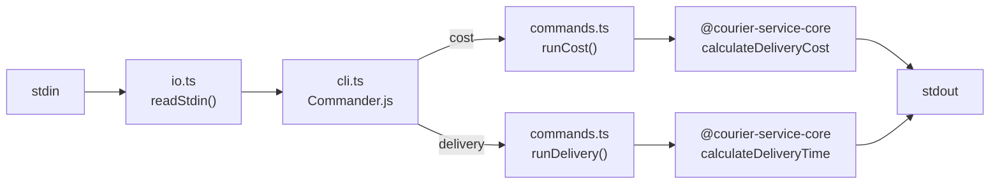

# @nurulizyansyaza/courier-service-cli

CLI application for the **Courier Service** App Calculator. Reads input from stdin and outputs delivery cost/time estimates.

## Setup

```bash
npm install
npx tsc
```

## Usage

### Problem 1 — Delivery Cost Estimation

```bash
printf '100 3\nPKG1 5 5 OFR001\nPKG2 15 5 OFR002\nPKG3 10 100 OFR003\n' | node bin/courier-service cost
```

Output:
```
PKG1 0 175
PKG2 0 275
PKG3 35 665
```

### Problem 2 — Delivery Time Estimation

```bash
printf '100 5\nPKG1 50 30 OFR001\nPKG2 75 125 OFR008\nPKG3 175 100 OFR003\nPKG4 110 60 OFR002\nPKG5 155 95 NA\n2 70 200\n' | node bin/courier-service delivery
```

Output:
```
PKG1 0 750 4.00
PKG2 0 1475 1.78
PKG3 0 2350 1.42
PKG4 105 1395 0.85
PKG5 0 2125 4.21
```

### Detailed Delivery Output

Use `--detailed` to see vehicle assignments, delivery rounds, and return times:

```bash
printf '100 5\nPKG1 50 30 OFR001\nPKG2 75 125 OFR008\nPKG3 175 100 OFR003\nPKG4 110 60 OFR002\nPKG5 155 95 NA\n2 70 200\n' | node bin/courier-service delivery --detailed
```

Output:
```
PKG1 0 750 4.00
  └─ vehicle=1 round=4 return=4.43
PKG2 0 1475 1.78
  └─ vehicle=1 round=1 return=3.57
PKG3 0 2350 1.42
  └─ vehicle=2 round=2 return=2.86
PKG4 105 1395 0.85
  └─ vehicle=1 round=1 return=3.57
PKG5 0 2125 4.21
  └─ vehicle=2 round=3 return=5.57
```

### Input Format

**Problem 1:**
```
baseCost packageCount
pkgId weight distance offerCode
...
```

**Problem 2 (same as above + fleet line):**
```
baseCost packageCount
pkgId weight distance offerCode
...
vehicleCount maxSpeed maxWeight
```

## Testing

```bash
npm test
```

## CI/CD

GitHub Actions workflow (`.github/workflows/ci.yml`) runs on push/PR to `main`:

1. **Test** — checks out `courier-service-core`, builds it, then runs CLI tests on Node 18 + 20
2. **Trigger Staging Deploy** — on push to `main`, triggers a staging deploy on [`courier-service`](https://github.com/nurulizyansyaza/courier-service), which triggers the staging deployment pipeline

Requires a `DEPLOY_TRIGGER_TOKEN` secret (fine-grained PAT with Actions + Contents write access on the `courier-service` repo).

## CLI Flow



## Project Structure

```
src/
  cli.ts         # Commander.js entry point with cost/delivery subcommands
  io.ts          # stdin reader
  commands.ts    # runCost, runDelivery logic
  index.ts       # Barrel exports
bin/
  courier-service  # Executable entry point
__tests__/
  commands.test.ts
  io.test.ts
```
